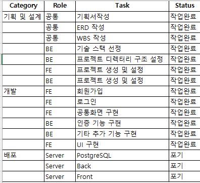

# 영어 학습 블로그 프로젝트

## 프로젝트 개요

- **주제**  
  영어 반복 연습을 돕는 블로그형 학습 플랫폼

- **기획 배경**  
  - 영어 회화 교육 및 창업 관심 
  - 이전부터 Deepgram API를 활용해보고 싶었음  

---

## 핵심 기능 요약

- 영어 문장을 문장 단위로 출력하고 반복 연습 가능하게 함
- STT(음성 인식)로 문장 일치 여부 판단
- Django 기반 블로그 CRUD, 인증/인가 시스템

---

## 기술 스택

| 구성 요소     | 사용 기술                            |
|--------------|--------------------------------------|
| 프론트엔드   | HTML, CSS, JavaScript (fetch, DOM 조작) |
| 백엔드       | Python, Django (함수형 뷰 기반)       |
| 데이터 저장   | PostgreSQL, Django ORM                |
| 음성 인식    | Deepgram API                          |

---

## 주요 기능 흐름

1. 로그인 후 메인 페이지 진입
2. 블로그 글 확인 또는 '학습하기' 기능 선택
3. 문장 출력 → 사용자가 발화 → STT로 일치 여부 확인
4. 일치 시 다음 문장 출력

---

## 와이어프레임 요약

- **메인페이지**
  - 소개 문구
  - 로그인 / 회원가입 버튼

- **학습 페이지**
  - 연습 시작하기

---

## WBS (작업 일정)

| 날짜   | 작업 내용 |
|--------|-----------|
| Day 1 | 프로젝트 구조 세팅, 앱 생성, 모델 및 admin 등록, 기본 뷰/템플릿 구성 |
| Day 2 | CRUD 기능 구축, 로그인/회원가입, 인증 처리, 댓글 기능 |
| Day 3 | Deepgram STT 통합, 음성 비교 로직 완성, 학습량 DB 저장, 발표 자료 정리 |


## 작업 일정 (WBS)


---

## URL 구조

## 📊 프로젝트 기능 및 URL 구조 정리표 (최종 발표 버전)

| 기능 구분         | 기능명              | 경로 예시                                          | 설명 |
|------------------|-------------------|--------------------------------------------------|------|
| 메인 기능        | 메인 페이지         | `/`                                               | 블로그 소개, 로그인/회원가입 버튼 |
| 블로그 기능      | 게시글 목록         | `/blog`                                           | 전체 게시글 제목 리스트 |
| 블로그 기능      | 게시글 상세         | `/blog/<int:id>`                                  | 제목 및 본문 확인 |
| 블로그 기능      | 글 작성             | `/blog/write/`                                    | 로그인 유저만 가능 |
| 블로그 기능      | 글 수정             | `/blog/edit/<id>/`                                | 작성자만 가능 |
| 블로그 기능      | 글 삭제             | `/blog/delete/<id>/`                              | 작성자만 가능, 삭제 후 목록 이동 |
| 블로그 기능      | 검색 기능           | `/blog/search/?q=tag`                             | 제목 또는 카테고리 기준 검색 |
| 예외 처리        | 잘못된 접근 시       | `/blog/999/` 등                                    | 안내 페이지 렌더링 |
| 인증 기능        | 회원가입            | `/accounts/accounts/register/`                    | 전체 공개 |
| 인증 기능        | 로그인              | `/accounts/accounts/login/`                       | 전체 공개 |
| 인증 기능        | 로그아웃            | `/accounts/accounts/logout/`                      | 로그인 유저만 가능 |
| 회원 기능        | 비밀번호 변경        | `/accounts/accounts/password/`                    | Django 기본 제공 |
| 회원 기능        | 프로필 수정          | `/accounts/accounts/profile/edit/`                | 사용자 닉네임 및 이미지 등 수정 |
| AI 학습 기능     | 연습 주제 선택 창     | `/practice/practice/`                              | AI 학습 주제 선택 화면 |
| AI 학습 기능     | 각 주제별 학습 페이지 | `/practice/practice/<주제제목>/`                  | 선택한 주제에 대한 학습 진행 화면 |

---

## DB 테이블 구조

| 테이블 | 주요 필드 |
|--------|-----------|
| **User** | username, password, email, date_joined 등 |
| **Post** | title, content, image, category, author(FK), views, created_at, updated_at |
| **Comment** | post(FK), author(FK), content, parent(FK, 대댓글), created_at, updated_at |
| **Script** | user(FK), content, source_type(default/manual), created_at |
| **PracticeLog** | user(FK), script(FK), sentence_index, repeat_count, date |

## ERD (DB 설계)


---

## 인증 / 인가 설계

### 인증 (Authentication)
- Django 기본 User 모델 사용
- 비밀번호 해싱: `set_password()`
- 로그인 처리: `authenticate()` + `login()`
- 로그아웃 처리: `logout()`

### 인가 (Authorization)
- `@login_required`로 비로그인 차단
- 글 수정/삭제 시 작성자 여부 검사
- 타인 접근 시 `HttpResponseForbidden()` 처리
- 삭제된 글 접근 시 404 페이지 출력

---


## normalize 함수 개선 및 적용 사례

### 문제 상황

-원문:  
    -I NEED TO TALK TO YOU,
-STT 결과:  
    -i need to talk to you
    사람이 보기엔 같지만 코드에선 다르게 인식됨

### 기존 코드 문제점

```javascript
if (recognized.trim().toLowerCase() === original.trim().toLowerCase())
```
    대소문자만 처리하고 문장부호나 공백 차이는 무시하지 못함

### 해결책: normalize 함수 도입

```javascript
function normalize(text) {
  const numberWords = {
    'zero': '0', 'one': '1', 'two': '2', 'three': '3',
    'four': '4', 'five': '5', 'six': '6', 'seven': '7',
    'eight': '8', 'nine': '9', 'ten': '10'
  };

  return text
    .toLowerCase()
    .replace(/[.,!?]/g, '')
    .replace(/\b(zero|one|two|three|four|five|six|seven|eight|nine|ten)\b/g,
      match => numberWords[match])
    .replace(/\s+/g, ' ')
    .trim();
}
```

###적용 코드
```javascript
if (normalize(recognized) === normalize(original)) {
  repeatCount += 1;
  feedback.innerText = `정확하게 말했어요! (${repeatCount}/30회 반복 중)`;
} else {
  feedback.innerText = `일치하지 않아요. 다시 말해보세요.`;
}
```

### 결과
-대소문자, 문장부호, 숫자 표현 차이까지 모두 처리 가능해짐
-정확한 문장 판단 가능해짐

---

## 문제 해결 경험

| 문제 | 해결 방법 |
|------|-----------|
| 음성 출력 기능 불안정 | Deepgram TTS 오류로 기능 제거, STT 중심 재설계 |
| URL 구조 혼란 | `/blog/`, `/practice/`, `/auth/` 등으로 명확히 구분 후 리팩토링 진행 |

---

## 느낀 점

- 구조나 URL 설계를 대충 만들면 유지보수가 어려움
- `.git` 폴더, 앱 분리 기준 등 기본기에서 많은 실수 경험
- 혼자 작업에 익숙했지만, 피드백을 받으며 개선의 중요성을 체감함
- 이번 프로젝트를 통해 웹 애플리케이션 개발 전반의 흐름을 익힐 수 있었음

---

